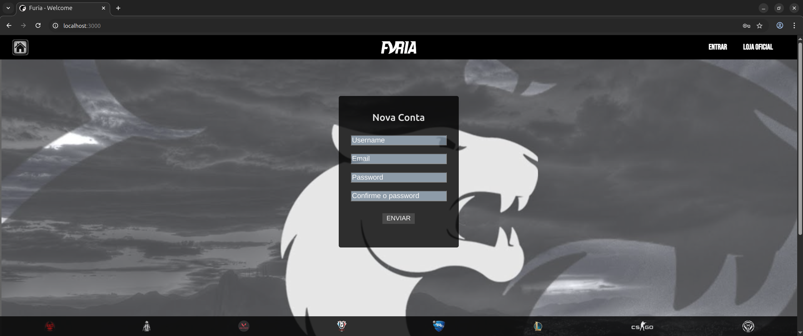

  <h2>Furia Web App</h2>

  <h4>The Community page with a chat room and a news feed about Furia and e-sports</h4>
  

  <h4>Typing @Furia on the chat, the message will be responding by the bot</h4>
  

  <h4>The best Furia campaigns</h4>
  

  <h4>Home page</h4>
  

  <h4>Login with jwt token</h4>
  

  <h4>Signup</h4>
  

